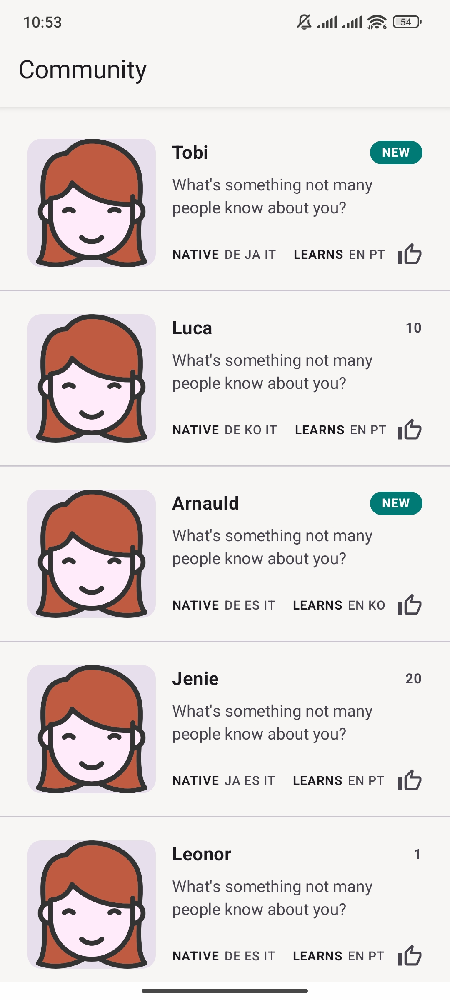

# Tandem Community Android Challenge

An Android application built for the Tandem Android engineering hiring challenge.

The app fetches and displays members of a language learning community from a remote paginated API. Users can like or unlike community members by tapping on their cards, and the liked state is persisted locally so it remains available after relaunching the app.

## Screenshot



## Features

* Fetches community members from the Tandem remote API
* Supports API pagination starting from page 1
* Loads 20 members per page and stops pagination when the last page is reached
* Displays community member information in a scrollable list
* Shows a `NEW` badge when `referenceCnt` is `0`
* Supports like/unlike interaction by tapping on a community card
* Persists liked members locally on the device
* Restores liked state after app relaunch
* Handles loading, pagination, and error states
* Includes unit tests and instrumented UI tests

## API

The app fetches community data from:

```text
https://tandem2019.web.app/api/community_{page}.json
```

Where `{page}` is the pagination parameter starting from `1`.

## Tech Stack

* Kotlin
* Jetpack Compose
* Material 3
* Kotlin Coroutines
* Flow
* Retrofit
* OkHttp
* Hilt
* DataStore Preferences
* Coil
* JUnit
* Kotlin Coroutines Test
* AndroidX Test
* Compose UI Testing

## Architecture

The project follows a clean, testable architecture with separation between data, domain, and presentation layers.

```text
app/
 └── src/
     ├── main/
     │   └── java/
     │       └── dev/mjamalidev/tandemcommunity/
     │           ├── data/
     │           │   ├── local/
     │           │   ├── remote/
     │           │   └── repository/
     │           ├── domain/
     │           │   ├── model/
     │           │   ├── repository/
     │           │   └── usecase/
     │           ├── presentation/
     │           │   ├── community/
     │           │   └── theme/
     │           └── di/
     ├── test/
     └── androidTest/
```

### Data Layer

Responsible for remote API calls, local persistence, DTO mapping, and repository implementation.

Main responsibilities:

* Fetch paginated community data from the API
* Store liked member IDs locally using DataStore
* Map API DTOs to domain models
* Combine remote community data with local liked state

### Domain Layer

Contains business models, repository contracts, and use cases.

Main responsibilities:

* Define core app models
* Expose use cases for loading community members
* Expose use cases for toggling liked state
* Keep business logic separated from Android UI details

### Presentation Layer

Built with Jetpack Compose and ViewModel.

Main responsibilities:

* Render community member list
* Manage loading, pagination, and error UI states
* Handle user interactions
* Trigger pagination when the user reaches the end of the list
* Observe reactive state from the ViewModel

## Persistence

Liked member state is stored locally using DataStore Preferences.

Only the liked member IDs are persisted. When the app is relaunched, the stored IDs are read again and applied to the community members returned from the API.

## Testing

The project includes:

* Repository tests
* ViewModel tests
* Error handling tests
* Compose UI tests

## Requirements

* Android Studio
* JDK 17
* Android SDK
* Android emulator or physical Android device for instrumented tests

## Build

To build the debug APK:

```bash
./gradlew clean assembleDebug
```

The generated APK will be available at:

```text
app/build/outputs/apk/debug/app-debug.apk
```

## Run Unit Tests

```bash
./gradlew testDebugUnitTest
```

## Run Instrumented Tests

An emulator or physical Android device must be connected before running this command:

```bash
./gradlew connectedDebugAndroidTest
```

## Full Verification Command

The project was verified with JDK 17 using:

```bash
./gradlew clean testDebugUnitTest
./gradlew assembleDebug
./gradlew connectedDebugAndroidTest
```

## APK

A debug APK is included in the repository at:

```text
artifacts/tandem-community-debug.apk
```

To recreate the APK inside the `artifacts` folder, run:

```bash
./gradlew clean assembleDebug
mkdir -p artifacts
cp app/build/outputs/apk/debug/app-debug.apk artifacts/tandem-community-debug.apk
```

To install the APK on a connected emulator or Android device:

```bash
adb install -r artifacts/tandem-community-debug.apk
```

## Notes and Trade-offs

* A single-module structure was used because the challenge scope is small and focused.
* The code is still organized by clean architecture layers to keep responsibilities separated and testable.
* DataStore was used for lightweight local persistence of liked member IDs.
* Manual pagination was implemented instead of Paging 3 to keep the solution simple and easy to review.
* Hilt was used for dependency injection to make the app easier to test and maintain.
* The app stores only local UI interaction state and does not modify the remote API data.

## Submission Contents

This repository includes:

* Full Android source code
* README documentation
* Unit tests
* Instrumented UI tests
* Gradle wrapper files
* Debug APK at `artifacts/tandem-community-debug.apk`